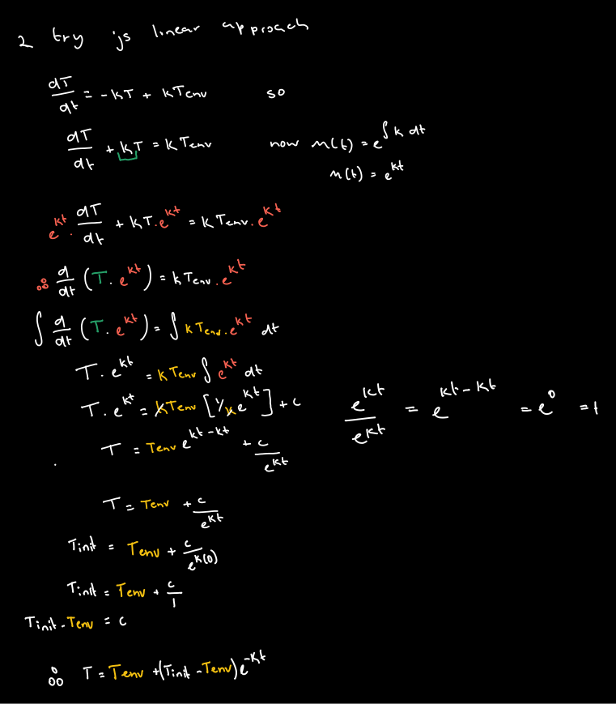
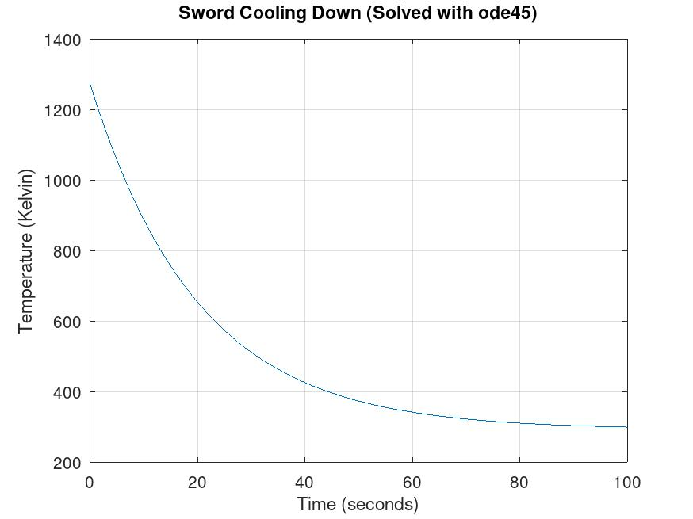
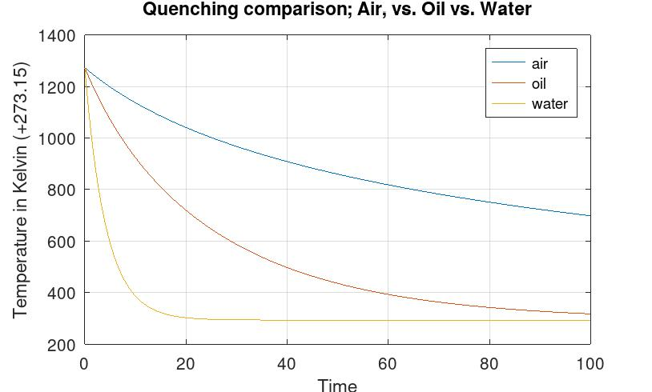

# Transient Thermal Quenching Simulation of a High-Carbon Steel Component: Air vs. Oil vs. Water

A computational physics and heat transfer project modeling the transient cooling rates of a heated (1000°C) high-carbon steel component/blade geometry using Ordinary Differential Equations **(ODEs).**. 

This project explores both:
1. **The Analytical Model:** Solving Newton's Law of Cooling by hand using an Integrating Factor.
2. **The Non-Linear Numerical Model:** Simulating real-world multi-medium quenching (Air, Oil, Water) including Stefan-Boltzmann thermal radiation via `ode45` in **GNU Octave / MATLAB**.

---

## Phase 1: Analytical Derivation (Linear Model)

To establish a baseline, we begin with **Newton’s Law of Cooling**, which assumes the rate of heat loss is proportional to the temperature difference between the object and its environment:

$$ \frac{dT}{dt} = -k(T - T_{env}) $$

Where:
* $T$ = Temperature of the sword as a function of time $t$
* $T_{env}$ = Ambient room temperature (constant)
* $k$ = Overall cooling rate constant

---

### Step-by-Step Derivation (Integrating Factor Method)

Rearranging into standard 1st-order linear ODE form

$$ \frac{dT}{dt} + kT = kT_{env} $$

#### 1. Calculate the Integrating Factor $M(t)$:
$$ M(t) = e^{\int k \, dt} = e^{kt} $$

#### 2. Multiply through by $M(t)$:
$$ e^{kt} \frac{dT}{dt} + k T e^{kt} = k T_{env} e^{kt} $$

#### 3. Recognize the Product Rule on the left side:
$$ \frac{d}{dt} \left( T \cdot e^{kt} \right) = k T_{env} e^{kt} $$

#### 4. Integrate both sides with respect to time ($t$):
$$ \int \frac{d}{dt} \left( T \cdot e^{kt} \right) dt = \int k T_{env} e^{kt} dt $$

$$ T \cdot e^{kt} = k T_{env} \left( \frac{1}{k} e^{kt} \right) + C $$

$$ T \cdot e^{kt} = T_{env} e^{kt} + C $$

#### 5. Isolate $T(t)$ to find the General Solution:
Divide both sides by $e^{kt}$:

$$ T(t) = T_{env} + C e^{-kt} $$

---

### Solving the Initial Value Problem (IVP)
To determine the arbitrary constant $C$, we apply the initial condition: at time $t = 0$, the temperature is $T_{init}$.

$$ T_{init} = T_{env} + C e^{0} $$
$$ T_{init} = T_{env} + C \implies C = T_{init} - T_{env} $$

Substituting $C$ back into the general solution yields the **Final Analytical Equation**:

$$ T(t) = T_{env} + (T_{init} - T_{env})e^{-kt} $$

---

### Handwritten Derivation Notes

---

### Analytical Verification Plot
Using initial parameters ($T_{init} = 1000^\circ\text{C}$, $T_{env} = 20^\circ\text{C}$, and $k = 0.05$), the equation was plotted to verify the classic exponential decay curve:

---

## Phase 2: The Non-Linear Quenching Model (Convection + Radiation)

While the linear model works at lower temperatures, cooling a sword from **1000°C** requires accounting for **Thermal Radiation**. At this temperature, the steel glows red-hot and dumps a massive amount of heat through electromagnetic radiation, governed by the **Stefan-Boltzmann Law**.

### The Governing Differential Equation
The rate of heat loss is the sum of **Convection** (heat carried away by fluid) and **Radiation** (heat radiated away by glowing light):

$$ \frac{dT}{dt} = - \left[ \frac{h \cdot A}{m \cdot c} (T - T_{env}) \right] - \left[ \frac{\epsilon \cdot \sigma \cdot A}{m \cdot c} (T^4 - T_{env}^4) \right] $$

> **Note on Units:** Because radiation scales with the fourth power ($T^4$), all calculations must be performed in **Kelvin**. Unlike Celsius, Kelvin is an absolute thermodynamic scale where zero represents true molecular stillness.

---

## Physical Parameters & Simulation Setup

The sword was modeled using typical engineering properties for a carbon steel blade (approximated as a flat plate):

| Property | Symbol | Value | Unit |
| :--- | :--- | :--- | :--- |
| **Mass** | $m$ | 1.5 | $\text{kg}$ |
| **Surface Area** | $A$ | 0.08 | $\text{m}^2$ |
| **Specific Heat Capacity** | $c$ | 460 | $\text{J}/(\text{kg}\cdot\text{K})$ |
| **Emissivity** | $\epsilon$ | 0.8 | dimensionless |
| **Stefan-Boltzmann Constant** | $\sigma$ | $5.67 \times 10^{-8}$ | $\text{W}/(\text{m}^2\cdot\text{K}^4)$ |
| **Initial Temperature** | $T_{init}$ | 1273.15 (1000°C) | $\text{K}$ |
| **Ambient Temperature** | $T_{env}$ | 293.15 (20°C) | $\text{K}$ |

### Cooling Mediums Modeled
The behavior of the fluid is dictated by the convective heat transfer coefficient ($h$):
* **Air (Still):** $h = 25 \text{ W}/(\text{m}^2\cdot\text{K})$
* **Quenching Oil:** $h = 300 \text{ W}/(\text{m}^2\cdot\text{K})$
* **Water:** $h = 2000 \text{ W}/(\text{m}^2\cdot\text{K})$

---

## Numerical Solution & Results

Because the $T^4$ term makes this ODE non-linear, finding a closed-form analytical solution on paper is impractical. The simulation was solved numerically using the **Runge-Kutta 4th/5th order method (`ode45`)** in **GNU Octave**.

### Simulation Plot

---

## Engineering & Metallurgy Insights

The resulting simulation demonstrates the critical heat extraction tradeoffs observed in metallurgy, tool manufacturing, and bladesmithing:

1. **Water Quench (Yellow Line):**
   * Drops from 1000°C to room temperature in **less than 15 seconds**. 
   * This rapid, violent heat extraction creates extreme thermal stress, often leading to warping, micro-fractures, or catastrophic blade failure.
2. **Oil Quench (Red/Orange Line):**
   * Reaches room temperature smoothly in **60 to 80 seconds**. 
   * This is the "sweet spot" for high-carbon steel—fast enough to transform austenite into hard martensite, but gentle enough to prevent cracking.
3. **Air Cooling (Blue Line):**
   * Retains heat for hundreds of seconds, dropping to only ~700 K after 100 seconds. 
   * This slow rate allows crystalline relaxation, used in blacksmithing for **normalizing** and **annealing** (softening) steel.

---

## How to Run

1. Clone or download this repository.
2. Open **GNU Octave** or **MATLAB**.
3. Run `advancedscr.m` to generate the simulation curves and figure window.
